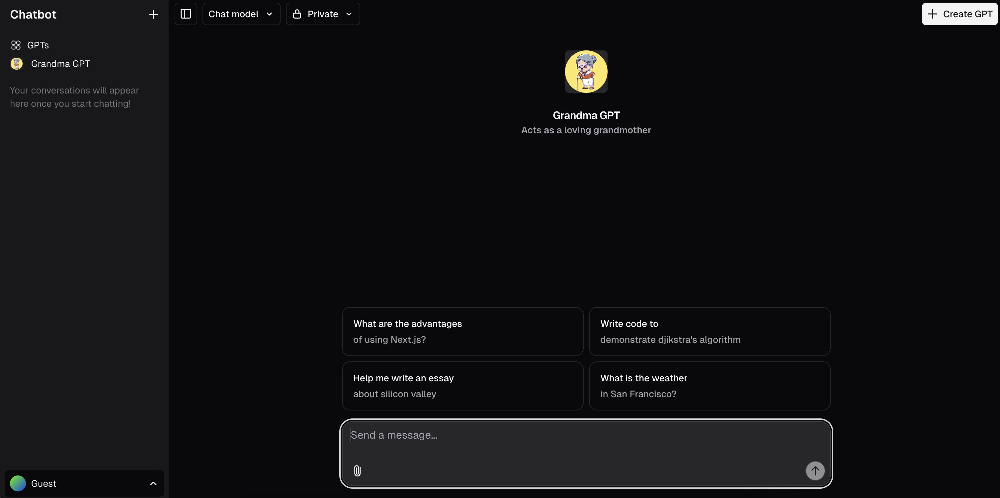

# Custom GPT Assistant Platform — Development Process & Setup

[](https://ai-chatbot-hgss.vercel.app/)

 

## 🛠️ Project Setup

To get started with development, several external services were configured and integrated into the environment. These include database, storage, and AI-related services:

### 1. Vercel + Supabase Integration

- A new Supabase instance was created via the [Vercel integration](https://vercel.com/integrations/supabase) to provide the PostgreSQL database and authentication backend.
- This enables seamless deployment workflows and environment management directly from Vercel.

### 2. x.ai API Key

- An API key was generated from [x.ai](https://x.ai/) to enable AI features within the application.
- The key is securely stored in the `.env.local` file under the appropriate variable name.

### 3. Redis Instance

- A Redis instance was provisioned
- Connection details were added to the environment configuration.

### 4. Vercel Blob Storage

- Vercel Blob was used to handle media or file uploads.
- Required credentials and endpoints were added to the environment file.

### 5. Environment Configuration

All sensitive credentials and configuration values were stored in the `.env.local` file, such as:

```env
SUPABASE_URL=...
SUPABASE_ANON_KEY=...
XAI_API_KEY=...
REDIS_URL=...
VERCEL_BLOB_TOKEN=...
```

### 6. Running locally

```bash
pnpm install
pnpm dev
```

Your app template should now be running on [localhost:3000](http://localhost:3000).

## 🧩 Debugging Setup (VS Code)

To streamline the development and debugging process, custom configurations were added to the VS Code debugger.

The `.vscode/launch.json` file includes settings for server-side, client-side, and full-stack debugging for a Next.js application.

## 🗄️ Database Migration with Drizzle

To set up the required database schema in the Supabase instance, a migration was performed using [Drizzle ORM](https://orm.drizzle.team/).

### Migration Command

A custom `build` script was configured to run the migration before building the Next.js app:

```json
"scripts": {
  "build": "tsx lib/db/migrate && next build"
}
```

## 🚧 Feature Development Workflow

To organize feature development, the project was divided into focused branches. Each branch addressed a specific functionality related to managing and interacting with GPT assistants.

### Branch: `create-assistants`

This branch focused on building the assistant creation pipeline.

- Created data **models** and **database migrations** using Drizzle.
- Built a **form UI** to allow users to create new GPT assistants.
- Implemented API **routes to persist assistant data** in the database, scoped to the currently authenticated user.

### Branch: `view-assistants`

This branch handled the user interface for managing existing GPT assistants.

- Built the **GPT management page** to view, edit, and delete created assistants.
- Added a **sidebar navigation** component:
  - Allows creating a new assistant.
  - Redirects to an existing chat using a selected assistant.
- Introduced **React context** to store and manage the assistant data application-wide, minimizing prop-drilling and improving state synchronization.

### Branch: `hook-gpt-to-chat`

This branch integrated the assistant system with the chat interface.

- Parsed the selected assistant ID from the **URL search parameters**.
- Loaded the corresponding assistant’s data dynamically and **injected it into the chat session**, enabling personalized interactions based on the assistant’s configuration.

---

> ✅ All features were tested locally before merging into the main branch.

## 📝 Future Improvements / TODOs

- Append each assistant's instruction to the prompt before sending messages, so chats follow the assistant’s purpose and tone.
- Add tests for new features:
  - Assistant creation
  - Viewing/editing/deleting assistants
  - Chat behavior using selected assistant
